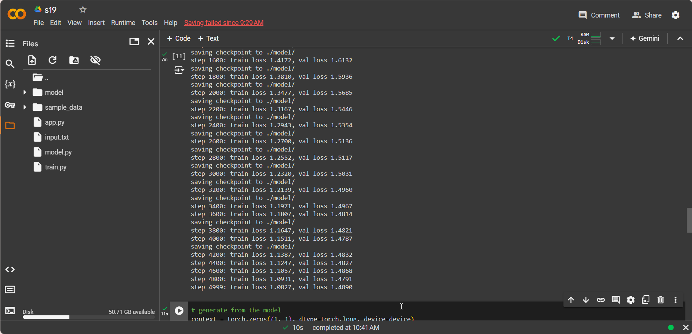
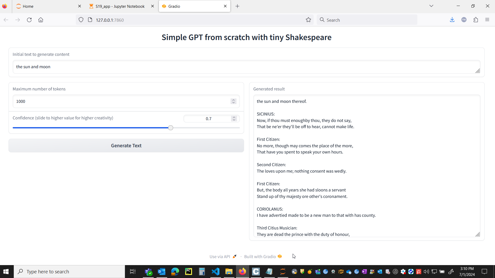

# Assignment 19

## Problem Statement

To understand and create a simple GPt from scratch with tiny shakespeare dataset and host it in gradio app to inference results.
The reference learnt is from Andrej karpathy's tutorial.

This repo contains related files

        app.py
        model.py
        train.py
        S19_train.ipynb
        S19_app.ipynb

- 

## Results

The code is trained in colab and the training file is **S19.ipynb**
Hugging space link: https://huggingface.co/spaces/Vvaann/Assignment_19

Below are the training, result screenshots and the loss reached **1.48** in 5000 iterations

gradio app 

